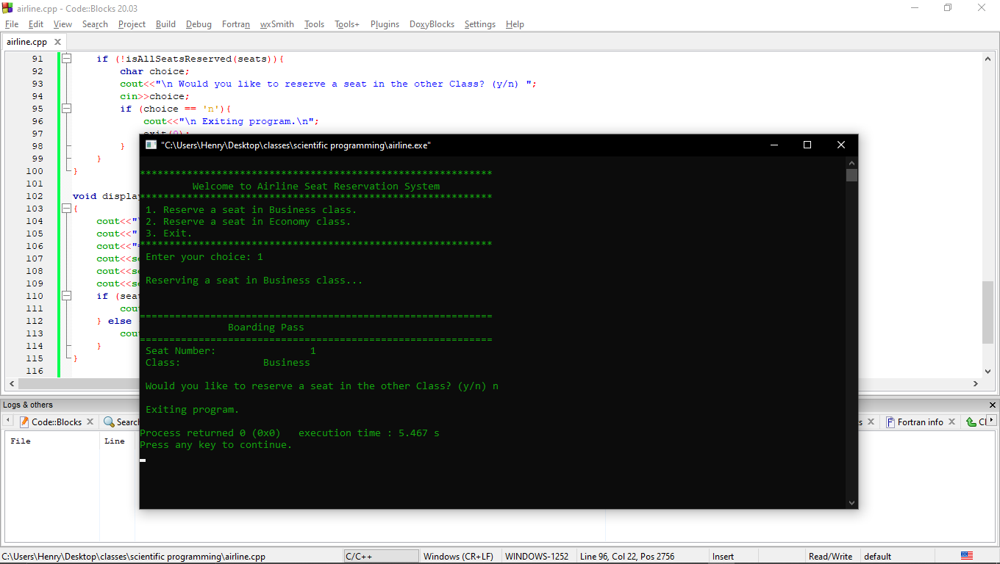

# Airline Seat Reservation System

This is a simple C++ program for an Airline Seat Reservation System. It allows users to reserve seats in either Business Class or Economy Class. The program dynamically updates seat availability and provides a boarding pass upon successful reservation.

## Features

- Reserve seats in Business Class or Economy Class
- Display available seats in each class
- Choose preferred seat number within available seats
- Display boarding pass with seat number and class
- Error handling for invalid inputs
- Exit option to end the program

## How to Use

1. Run the program.
2. Choose an option from the menu:
   - Reserve a seat in Business Class
   - Reserve a seat in Economy Class
   - Exit the program
3. If choosing to reserve a seat:
   - Enter your preferred seat number.
   - Confirm your reservation.
4. If all seats are reserved, the program informs the user accordingly.
5. Repeat steps 2-4 until all desired reservations are made or choose to exit the program.

## Illustration



## Requirements

- C++ compiler (e.g., g++)
- Terminal or command prompt.
- Code Blocks or any C++ IDE.

## Installation

1. Clone the repository:
   
   ```bash
   git clone https://github.com/H3nryK/Airline-Reservation-System.git


2. Navigate to the project directory:

   ```bash
   cd Airline-Reservation-System


3. Compile the program:

   ```bash
   g++ main.cpp -o airline


4. Run the program:

   ```bash
   ./airline


## License

This project is licensed under the MIT License - see the [LICENSE](LICENSE) file for details.
